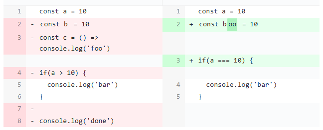
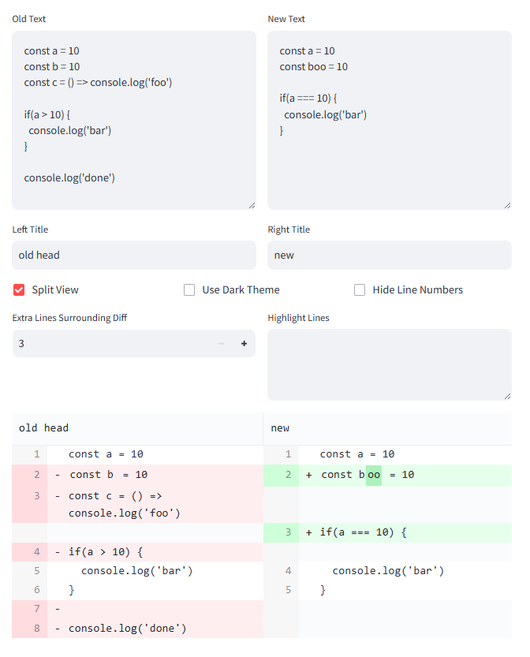

# streamlit-diff-viewer
git-like diff viewer for streamlit webapp



## Installation

```bash
pip install st-diff-viewer
```

## Usage

```python
from st_diff_viewer import diff_viewer

old_text = "a = 0"
new_text = "a = 1"
diff_viewer(old_text, new_text, split_view=True)
```

run example:

```bash
streamlit run example.py
```



## Buiding from source

### Prerequisites

- nodejs >= 18.x
- yarn >= 1.22.x
- poetry >= 1.2.x
- python >= 3.8.x

### Building

```bash
./build.sh
```

### Publishing

```bash
poetry publish
```

## License

This project is licensed under the MIT License - see the [LICENSE](LICENSE) file for details
