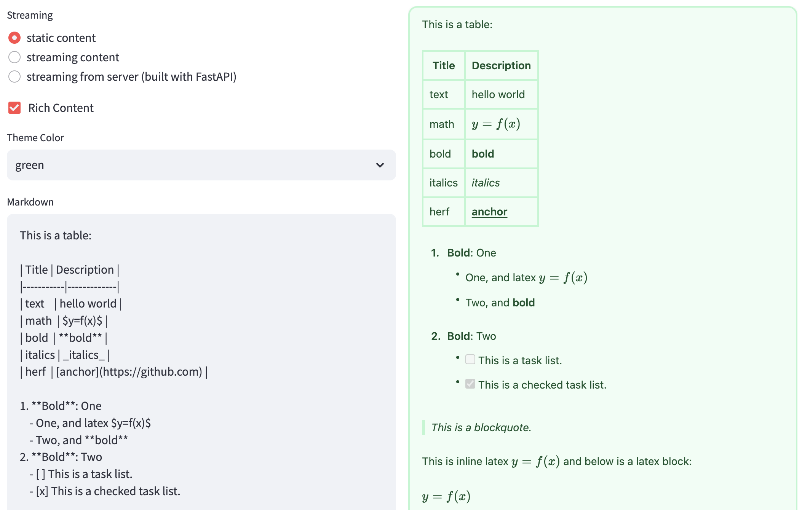

# streamlit-markdown

react-markdown with streaming support for streamlit webapp.


- [x] streaming rendering of markdown text
- [x] support for latex math, mermaid diagrams, code highlighting
- [x] support for tables, images, links

> Have a try at https://streaming-markdown.streamlit.app/



## Installation

```bash
pip install streamlit-markdown
```

## Usage

static content:

```python
from streamlit_markdown import st_markdown

markdown_text = "$ y = f(x)$"
st_markdown(markdown_text)
```

streaming content:

```python
from streamlit_markdown import st_streaming_markdown

markdown_text = "$ y = f(x)$"
def token_stream():
    for token in markdown_text:
        yeild token
st_streaming_markdown(token_stream, key="token_stream") # key must be set to prevent re-rendering
```

combined streaming content:

```python
from streamlit_markdown import st_streaming_markdown

markdown_text = "$ y = f(x)$"
def token_stream():
    import random
    for token in markdown_text:
        if random.rand() > 0.5:
            yeild token
        else:
            def callable_token():
                return token
            yeild callable_token
st_streaming_markdown(token_stream, key="token_stream") # key must be set to prevent re-rendering
```

run example:

```bash
streamlit run example.py
```


## Advanced Usage

There are 3 ways for Style Customization!

### Select another theme_color

```
GLOBAL_THEME_COLOR = Literal["blue", "orange", "green", "red", "purple", "pink", "indigo", "yellow", "teal", "cyan", "gray", "slate", "dark", "light", "null", "custom"]
MERMAID_THEME = Literal["default", "forest", "dark", "neutral", "base"]
```

I have annotated the type. You should be able to see a type hint if you are using `vscode+pylance`:


### Let theme_color == "custom" and specific custom_color

In this way, you can control the color of border and text separately.

The value follows the color naming of Tailwind CSS.

```python
custom_color = {
    "bg": "bg-gray-100",
    "border": "border-gray-300",
    "text": "text-green-900",
    "hover_bg": "hover:bg-gray-200",
    "hover_text": "hover:text-gray-900",
}
final_content = st_markdown(
    content,
    theme_color="custom",
    mermaid_theme=mermaid_theme,
    mermaid_theme_CSS=None,
    custom_color=custom_color,
    custom_css=None,
    key="content",
)
```

### Specific custom_css

By this way, the value of custom_css dict should be empty string (at least, not None).
If the value is empty string, it will be ignored and theme_color system will be used when rendering the type of markdown block html.
Otherwise, the custom css value will replace all the class style of the html element.
Use it at your own risk!

The inner code is like:

```jsx
<a className={
custom_css.a_class.length > 0 ? custom_css.a_class : classNames(
    classNameByTheme(theme_color, ["text", "hover_text"], custom_color),
)
} />
```


```python
custom_css = {
    "a_class": "text-green-900 border-grey-900 hover:text-gray-900",
    "h1_class": "",
    "h2_class": "",
    "h3_class": "",
    "h4_class": "",
    "h5_class": "",
    "h6_class": "",
    "p_class": "",
    "strong_class": "",
    "em_class": "",
    "code_class": "",
    "code_button_class": "",
    "code_latex_class": "",
    "code_mermaid_class": "",
    "pre_class": "",
    "ul_class": "",
    "ol_class": "",
    "li_class": "",
    "table_class": "",
    "thead_class": "",
    "th_class": "",
    "td_class": "",
    "blockquote_class": "",
}
final_content = st_markdown(
    content,
    theme_color="custom",
    mermaid_theme=mermaid_theme,
    mermaid_theme_CSS=None,
    custom_color=None,
    custom_css=custom_css,
    key="content",
)
```


## Building from source

### Prerequisites

- nodejs >= 18.x
- yarn >= 1.22.x
- poetry >= 1.2.x
- python >= 3.8.x

### Building

```bash
./build.sh
```

### Publishing

```bash
poetry publish
```

## License

This project is licensed under the MIT License - see the [LICENSE](LICENSE) file for details
